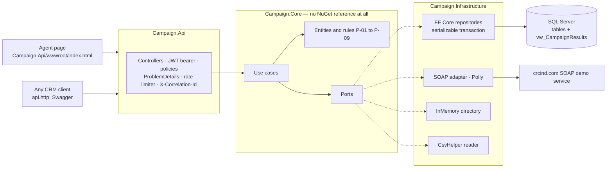

# Customer Reward Campaign

A telecom operator runs a one-week campaign in which call-centre agents award loyal customers a
discount, at most five customers per agent per day. Agents make mistakes, so a grant can be corrected.
A month later a CSV report arrives listing the customers who actually bought; it is merged with the
grants and the campaign results are exposed through the API. The customer data itself comes from an
external SOAP service.

The API is the product: the same scenario has to be usable from different CRM systems, so every rule
lives behind endpoints rather than inside a screen.

- **Runtime:** .NET 10, ASP.NET Core with controllers, EF Core 10, SQL Server 2022
- **Tests:** 142 xUnit tests, including parallel tests for the four concurrency rules
- **Assumptions:** [`docs/ASSUMPTIONS.md`](docs/ASSUMPTIONS.md)
- **Decisions and what they cost:** [`docs/DECISIONS.md`](docs/DECISIONS.md)

## Architecture



Dependencies point one way: `Api → Infrastructure → Core` and `Api → Core`. `Campaign.Api` references
`Campaign.Infrastructure` only to register it — a single `AddInfrastructure(configuration)` call —
and no controller ever sees a `DbContext`.

| Project | Contains |
|---|---|
| `Campaign.Core` | Entities, rules, use cases, ports. **No NuGet reference**, enforced by a test. |
| `Campaign.Infrastructure` | EF Core persistence, SOAP and in-memory customer directories, CSV reader |
| `Campaign.Api` | Controllers, authentication, policies, OpenAPI, the agent page |
| `Campaign.Tests` | xUnit: unit tests against in-memory ports, integration tests against SQL Server |

Because `Campaign.Core` references nothing, every business rule runs in milliseconds with no database
and no web host. The concurrency rules cannot be tested that way, so they are tested through real
HTTP against real SQL Server.

## Running it

Requires the .NET 10 SDK (`dotnet --list-sdks` must list a 10.x entry) and Docker.

**1. SQL Server.** Docker runs the database only; the API runs with `dotnet run` so it can be
debugged normally.

```bash
cp .env.example .env
docker compose up -d
```

**2. Configuration.** No credential is committed. `.env` holds the local container's password, and
the API reads its own settings from User Secrets. `Campaign.Api/appsettings.Example.json` documents
every key the application reads.

```bash
dotnet user-secrets set "ConnectionStrings:Campaign" "Server=localhost,1433;Database=Campaign;User Id=sa;Password=change-me-Local1;TrustServerCertificate=True;Encrypt=False" --project Campaign.Api
dotnet user-secrets set "Auth:SigningKey" "local-demo-signing-key-that-is-long-enough-for-hs256" --project Campaign.Api
dotnet user-secrets set "Directory:Provider" "InMemory" --project Campaign.Api
```

`Directory:Provider` chooses the customer catalogue: `Soap` calls the real service, `InMemory` keeps
the demo working without it. **The public demo service at `crcind.com` has been refusing connections,
so use `InMemory` for a demo you need to be sure of.**

**3. Start.** Migrations are applied on startup, and the seed is written only when the database is
still empty: one campaign running from three days ago to three days ahead, and three agents.

```bash
dotnet run --project Campaign.Api --urls http://localhost:5088
```

- Agent page: <http://localhost:5088/>
- Swagger: <http://localhost:5088/swagger>

**Without Docker:** point `ConnectionStrings:Campaign` at any SQL Server you already have. Nothing
else changes.

## Demo

The whole flow works from the page at <http://localhost:5088/>, without Swagger: sign in, pick the
campaign, search a customer, award the discount, watch the counter, void a grant and watch the slot
come back. The results table appears only for an `admin` token, because an agent gets a `403` from
that endpoint and should not be offered a button that fails.

[`api.http`](api.http) walks the same ground request by request, in the order a demo goes, and adds
the cases a page cannot show: an idempotent replay, a reused key, a daily limit reached, an import of
a deliberately dirty file, and the report. Open it in Visual Studio, VS Code with the REST Client
extension, or Rider, and run it from the top — each request feeds the next, so no ids need to be
pasted anywhere.

Sample files for the import step are in [`samples/`](samples): `purchases-clean.csv` (one customer
with three purchases) and `purchases-dirty.csv` (bad dates, an empty customer id, an unknown
customer, an amount without a currency, a broken amount).

## Security

Every endpoint needs a JWT bearer token except two: `/health`, and the development login at
`POST /api/v1/auth/token`, which cannot require one because it is what hands tokens out.

| Account | Password | Role |
|---|---|---|
| `agent-1`, `agent-2`, `agent-3` | `<account>-password` | `agent` |
| `admin-1` | `admin-1-password` | `admin` |
| `integration-1` | `integration-1-password` | `integration` |

These unlock nothing but a local demo: the token controller is removed from the application model
outside Development, so its routes do not exist there.

- **Roles** `agent`, `admin`, `integration`. `integration` is a system account for the CSV import, not
  a person.
- **Policies, not role checks in controllers:** `CanCreateGrant`, `CanVoidGrant`, `CanImport`,
  `CanViewReports`, `CanReadCampaigns`, `CanReadCustomers`, `CanReadGrants`. A fallback policy
  requires a token everywhere, so a new controller is protected by default rather than by somebody
  remembering.
- **Ownership** is a rule, not a policy: an agent may void only their own grant, and the use case that
  knows whose it is answers `403 forbidden-agent-scope`.
- **Rate limiting:** 100 requests a minute per token, 10 a minute on the import, counted per token so
  one busy agent does not spend another's budget.
- **Errors** are RFC 7807 `ProblemDetails` with a machine-readable `type` from one catalogue, and every
  response carries `X-Correlation-Id`.
- **Import:** at most 10 MB, extension and content type checked, and the file is read into memory and
  never written to disk — the name it arrived with can never become a path.
- **HTTPS** is redirected to, and HSTS is on outside Development. **There is no CORS**: the API serves
  its own page, so the browser and the endpoints share an origin.
- **No secret is committed.** `.env` and User Secrets hold them; `appsettings.Example.json` documents
  the keys.

Moving to Microsoft Entra ID means setting `Auth:Authority` and `Auth:Audience` in configuration
instead of a signing key. The handler then fetches the issuer's keys itself and no code changes.

## Business rules

| | Rule | Where it is enforced |
|---|---|---|
| P-01 | Grant only while the campaign is active and the business date is inside its window | `Campaign.IsOpenOn`, time zone from `Campaign:TimeZoneId` |
| P-02 | At most `DailyLimitPerAgent` active grants per agent per business date | Serializable transaction, agent row locked first — see [`docs/DECISIONS.md`](docs/DECISIONS.md#2-the-daily-limit-through-a-serializable-transaction-plus-a-lock-on-the-agents-own-row) |
| P-03 | One active grant per customer per campaign, across all agents | Filtered unique index `WHERE Status = 'Active'` |
| P-04 | Voiding records reason, actor and time; the slot frees itself | The count and the index only see active grants |
| P-05 | A grant is never deleted or edited; a correction is a void plus a new grant | Conditional `UPDATE ... WHERE Status = 'Active'` |
| P-06 | The same idempotency key returns the same grant, never a second one | Unique index per agent, plus a replay answer |
| P-07 | The customer name and the discount are frozen at the moment of the grant | Copied onto the row, never refreshed |
| P-08 | The same file does not import twice into one campaign | Unique index on `(CampaignId, FileSha256)`, insert then read the winner |
| P-09 | Conversion is distinct converted grants over active grants, never above 100% | `vw_CampaignResults` |

Each rule has at least one test named after it. The four that only mean anything under load — P-02,
P-03, P-06 and P-08 — are tested with ten or more simultaneous HTTP requests, and those tests pass ten
runs in a row.

## Mapping to Dynamics 365

| Here | Dynamics 365 |
|---|---|
| Campaign | Campaign |
| Customer (from the SOAP catalogue) | Contact / Account |
| RewardGrant | Campaign Response |
| PurchaseResult | Sales Order |
| Agent | System User (record owner) |
| An agent sees only their own records | Record ownership |
| Voiding instead of deleting | Audit |
| CSV import | Data import (SSIS or Azure Data Factory in production) |
| `vw_CampaignResults` | Source for SSRS / Power BI |

A `DataverseCustomerDirectory` implementing the existing `ICustomerDirectory` port is how this
solution would read customers from Dynamics 365 — without a line changing in `Campaign.Core`.

## Build and test

```bash
dotnet build
ConnectionStrings__Campaign="Server=localhost,1433;Database=Campaign;User Id=sa;Password=change-me-Local1;TrustServerCertificate=True;Encrypt=False" dotnet test
```

The tests use their own `CampaignTests` database on the same server and never touch the one the API
uses. They never reach the network: the SOAP adapter is tested against a fake of the generated
contract, using the envelopes in `tests/fixtures/soap/`.

CI runs the same two commands against a SQL Server service container
([`.github/workflows/ci.yml`](.github/workflows/ci.yml)).

## What I would do next

In this order, and for these reasons:

1. **Map the remaining concurrency races onto the catalogue.** The unique-index races that matter are
   handled, but a race that violates an index nobody anticipated still surfaces as a 500.
2. **Supersede an import batch.** A corrected file imports as a second batch beside the first, and
   both are counted. Superseding needs a decision about the grants the first batch matched.
3. **Record real SOAP responses.** The fixtures are synthetic because the service was down; they are
   marked as such and the tests parse them, so replacing them is a file swap.
4. **A production identity provider.** Two configuration keys, as described above, plus deleting the
   development login.
5. **Pagination on `/grants` and `/imports/{id}`.** A week of one campaign is small; a year of them is
   not.
6. **Structured logging with the correlation id as a scope.** The id is on every response already; it
   is not yet on every log line.
